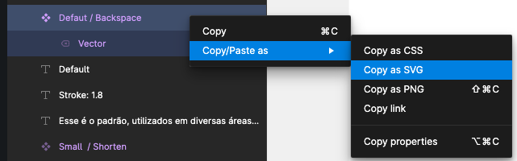
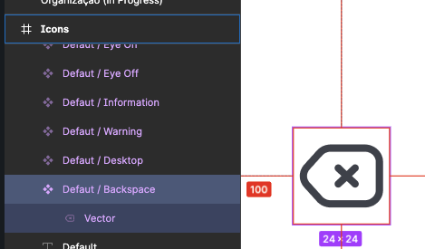
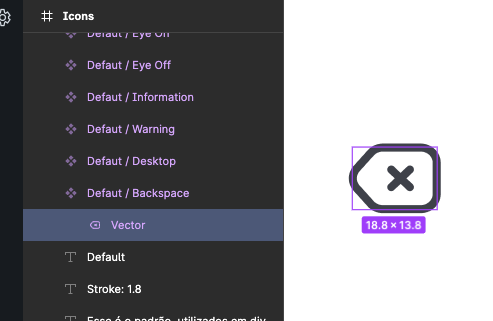
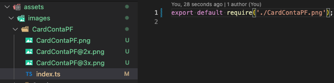

# Importação de imagens e ícones

## Imagens vetorizadas (SVG)

### Exportar imagens SVG que nao são ícones do Figma

- Selecionar no Figma a imagem selecionar o `container` desejado na hierarquia.
- Com o botão direito: Copy/Paste as -> Copy as SVG.

    

- Usar o SVG Playground para converter o SVG exportado pelo Figma, em um componente SVG do React Native: https://react-svgr.com/playground/?expandProps=start&native=true&typescript=true

    > Habilitar as opções React Native, TypeScript, e desabilitar o SVGO no menu a esquerda. 

- Criar uma pasta com o nome da imagem em `assets/images/MinhaImagem` e criar um arquivo `index.tsx` para colar o conteúdo convertido.
- Exportar a imagem com as demais em `assets/images/index.ts` (respeitar a ordem alfabética).


### Exportar ícones SVG do Figma

- Identificar se o ícone ja foi adicionado ao projeto (é possível verificar rodando o projeto style guide, no stories "Icons")
- Por padrão os nomes foram todos traduzidos para o inglês.
- Criar o componente dentro do diretório respectivo ao tamanho do ícone (`default`, `heavy`, `large`, `small` e `thin`), exemplo: `assets/icons/{tamanho}/MeuIcone/index.tsx`
- Seguir os passos para exportar imagem SVG do Figma conforme descrito na seção anterior.

    > Atenção para selecionar o `container` externo ao ícone, para que todos os ícones tenham o mesmo tamanho.

    |Certo ✅|Errado ❌|
    |-|-|
    |||

- Adicionar o `viewBox` do SVG original se não vier automaticamente.
- Expor as `props` customizáveis, como `color`, e usa-las nos campos necessários. 
- Expor também as props restante com `...others`, e coloca-la por último no `<Svg >`
- Adicionar os valores default de `width` e `height` com os mesmos valores do `viewBox`.

    Exemplo:

    ```tsx
    import * as React from 'react';

    import Svg, { SvgProps, Path } from 'react-native-svg';

    const Airplane = ({
      color,
      width = 24,
      height = 24,
      ...others
    }: SvgProps) => (
      <Svg
        fill="none"
        viewBox="0 0 24 24"
        width={width}
        height={height}
        {...others}
      >
        <Path
          d="..."
          stroke={color}
        />
      </Svg>
    );

    export default Airplane;
    ```

- Exportar o componente criado junto com os demais ícones em `assets/icons/{tamanho}/index.ts` (respeitar a ordem alfabética).

- Se estiver no `style-guide`, você pode testar se está obedecendo tamanho e cor customizadas rodando o Storybook.

## Imagens binárias (PNG e JPG)

### Exportar imagens binárias no Figma

- Selecionar no Figma a imagem selecionar o `container` desejado na hierarquia.
- Do lado direito da tela, selecionar a aba "export".
- Verificar o `preview` se esta como desejado.
- Clicar duas vezes no "`+`", para exportar também as versões @2x e @3x.
- Clicar em `Export` para baixar o `ZIP`.

    

- Passar as 3 imagens no TinyPNG [https://tinypng.com/](https://tinypng.com/).

    Quando carregamos imagens que nao são vetorizadas, o compilador nao consegue otimizar o seu carregamento, apenas exibe o que foi importado. Então usamos o TinyPng para fazer essa otimização com a intenção de:

    - Reduzir o tamanho final do aplicativo
    - Reduzir o tempo de carregamento das telas que carregam essas imagens

- Criar uma pasta com o nome da imagem em `assets/images/MinhaImagem`, e copiar os 3 arquivos para dentro.
- Criar um `index.ts` para importar a imagem e exportar como objeto, exemplo:

    

- Exportar a imagem com as demais em `assets/images/index.ts` (respeitar a ordem alfabética).

### Imagens binárias estáticas no React Native

Para imagens estáticas não é obrigatório passar altura e largura, pois o React Native consegue calcular a partir do arquivo no momento da compilação. Porém, você deve passar a altura e a largura para que o `<Image >` redimensione o componente de acordo com o tamanho que você deseja exibir na tela.

Por fim, adicionamos o tratamento do escalonamento (`cover` ou `contain`). 

```tsx
<Image 
  source={Images.MinhaImagem} 
  style={{
    width: 300,
    height: 100
  }}
  resizeMode="cover" // escolher de acordo com a necessidade
/>
```

> Mais detalhes https://reactnative.dev/docs/images#static-image-resources

### Imagens binárias dinâmicas no React Native

Para imagens dinâmicas (obtidas via API), o tamanho da imagem não é conhecido no momento de compilação, por isso devemos obrigatoriamente passar o tamanho esperado da imagem e tratar o escalonamento (`cover` ou `contain`). 

Caso não sejam definidos altura e largura, a imagem vai ficar com tamanho 0 e teremos a impressão que a imagem não foi carregada.

```tsx
<Image 
  source={{ uri: 'https://reactjs.org/logo-og.png' }} 
  style={{
    width: 300,
    height: 100
  }}
  resizeMode="cover" // escolher de acordo com a necessidade
/>
```

> Mais detalhes https://reactnative.dev/docs/images#network-images
