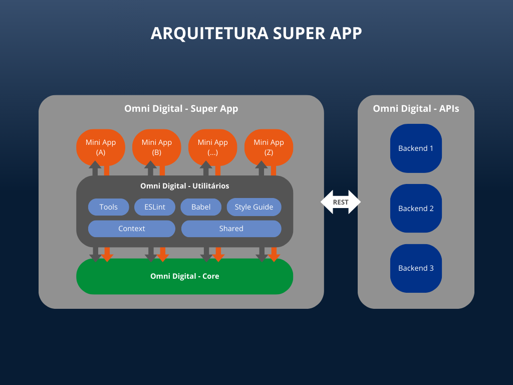

# Arquitetura SuperApp

## Visão geral



**Utilitários**: Repositórios de utilitários compartilhados entre os mini apps e o core

- [Tools](https://github.com/microfrontend/project-tools-mf): Ferramentas de desenvolvedor como scripts e configurações;
- [ESLint](https://github.com/microfrontend/eslint-config-mf-project): Configurações do ESlint;
- [Babel](https://github.com/microfrontend/babel-preset-mf-project): Configurações do Babel;
- [Style Guide](https://github.com/microfrontend/project-style-guide-mf): Componentes relacionados à tema e design system, sem regra de negócio envolvida, para reutilização entre apps. Possui Storybook para visualização dos componentes;
- [Context](https://github.com/microfrontend/project-context-mf): Componentes não visuais compartilhados;
- [Shared](https://github.com/microfrontend/project-shared-mf): Componentes visuais compartilhados com regra de negócio envolvida.

**Mini Apps**: MiniApps antes legados agora reescritos em React Native para nova arquitetura e estrutura. São instalados como dependências do projeto core e instalam os utilitários.

**Core**: App que instala todos os mini apps e utilitários e é construído como versão final para a loja.

## Estrutura dos projetos

A estrutura básica do `core` ou de um `submódulo` deve seguir a estrutura:

```sh
{src|lib}             # no core "src", nos submódulos "lib"
|
+-- assets            # pode conter rodos os arquivos estáticos, como imagens e ícones (fonts devem ficar na pasta "assets" do React Native)
|
+-- components        # componentes compartilhados, utilizados na aplicação inteira
|
+-- config            # configurações globais, como variáveis de ambiente
|
+-- features          # módulos baseados em funcionalidades (features)
|
+-- hooks             # hooks compartilhados, utilizados na aplicação inteira
|
+-- providers         # providers compartilhados, se houverem (Context API, etc)
|
+-- navigators        # componentes que controlam a navegação de telas de toda a aplicação
|
+-- stores            # persistência de valores compartilhados em toda a aplicação (async-storage, secure-storage, etc)
|
+-- types             # tipos globais compartilhados em toda a aplicação
|
+-- utils             # códigos úteis com funções compartilhadas em toda a aplicação
```

### Funcionalidades (`features`)

Cada pasta `feature` deve conter o código específico de uma funcionalidade. Isso ajuda a manter as funcionalidades isoladas, possibilitando a migração de uma funcionalidade de um `submódulo` para outro, caso necessário.

Com o objetivo de manter a aplicação o mais escalável possível, tente manter a maior parte do código dentro do diretório `features`, que deve conter coisas de diversas funcionalidades diferentes.

Deste modo, fica muito mais fácil a manutenção, do que uma única grande pasta com todo o código dentro.

A estrutura de uma `feature` deve ser:

```sh
{src|lib}/features/minha-funcionalidade
|
+-- api         # requests de API request e hooks específicos relacionados a chamadas de API
|
+-- assets      # assets específicos da funcionalidade
|
+-- components  # componentes específicos da funcionalidade
|
+-- hooks       # hooks específicos da funcionalidade
|
+-- providers   # providers específicos da funcionalidade, se houverem (Context API, etc)
|
+-- navigation  # navigators específicos da funcionalidade
|
+-- screens     # componentes de telas específicos da funcionalidade
|
+-- stores      # armazenamento de estados específicos da funcionalidade (async-storage, secure-storage, etc)
|
+-- types       # tipos globais específicos da funcionalidade
|
+-- utils       # códigos úteis com funções compartilhadas específicas da funcionalidade
|
+-- index.ts    # ponto de entrada da funcionalidade, aqui deve ser exportado o Navigator da funcionalidade, bem como qualquer API que precise ficar exposta
```

Uma pasta de `feature` também pode conter outras funcionalidades (se usada apenas dentro da funcionalidade mãe) ou ser mantida separada, é uma questão avaliar cada caso.

Tudo que necessite ser exposto, deve ser exportado do arquivo `index.ts`, se comportando como uma API pública da `feature`.

Quando houver necessidade de importar algo de dentro de uma `feature`, faça assim:

```ts
import {AwesomeComponent} from "src/features/minha-funcionalidade";
```

E não assim:

```ts
import AwesomeComponent from "src/features/minha-funcionalidade/components/AwesomeComponent";
```

### Componentes e outros recursos (`api`, `hooks`, `utils`, etc)

#### Deixe as coisas próximas de onde serão usadas

Sempre mantenha os componentes/recursos, estilos, estados e testes, o mais próximo de onde será utilizado.
Isso não fará sua base de códigos apenas mais legível e fácil de entender, mas também irá melhorar a performance da aplicação, reduzindo as renderizações redundantes em atualizações de estados.

#### Organização dos recursos

Tanto os recursos compartilhados, quanto os recursos específicos das `features`, devem seguir um padrão de nomenclatura e organização das pastas.

```sh
|
+-- components
|   +-- index.ts                        # arquivo que expõe todos os "components" acessíveis de fora do módulo/feature
|   |
|   +-- NomeComponente                  # diretório com o nome do componente em CamelCase
|   |   |
|   |   +-- index.tsx                   # implementação do componente
|   |   +-- NomeComponente.spec.tsx     # testes referente ao componente
|   |
|   +-- OutroComponente                 # ...
|
+-- hooks
|   |
|   +-- useMeuHook
|   |   +-- index.ts                    # implementação do hook
|   |   +-- useMeuHook.spec.ts          # testes referente ao hook
|
+-- utils
|   +-- index.ts                        # arquivo que expõe todos os "utils" acessíveis de fora do módulo/feature
|   |
|   +-- formatter
|   |   +-- maskDocument
|   |   |   +-- index.ts                # implementação do formatter
|   |   |   +-- maskDocument.spec.ts    # testes referente ao formatter
|   |
|   +-- parser                          # ...
|   |   +-- parseDocument
|   |   |   +-- index.ts                # implementação do parser
|   |   |   +-- parseDocument.spec.ts    # testes referente ao parser
|
+-- etc ...
```

#### Abstraia componentes compartilhados em bibliotecas

Componentes que fazem parte do *design system*, ou que tiverem a necessidade de reuso em diversos `submódulos`, devem ser acomodados no repositório [`style-guide`](../architecture/style-guide.md).

Também é uma boa ideia envolver (*wrap*) componentes de terceiro para adaptá-los a necessidade do app `project`.
Isso facilita a manutenção e até a substituição de componentes de terceiro, sem a necessidade de refatorar a aplicação inteira.
