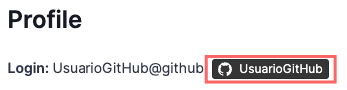
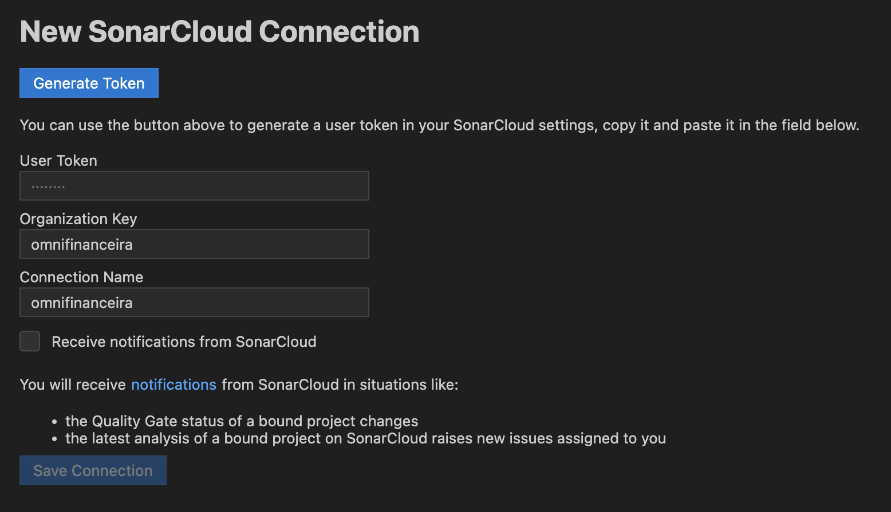
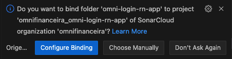
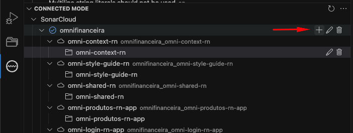
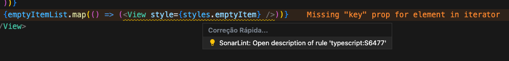
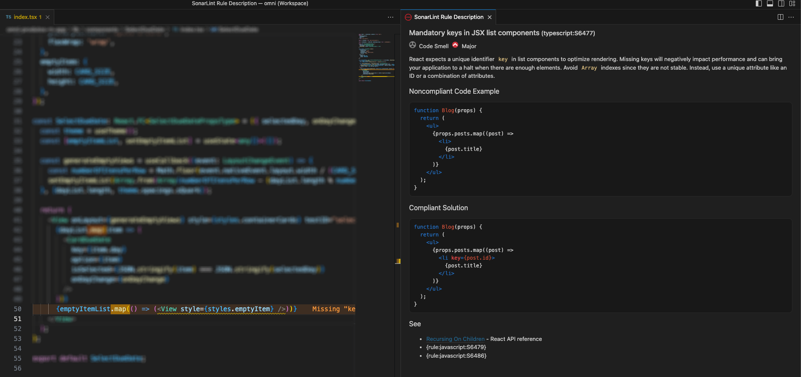
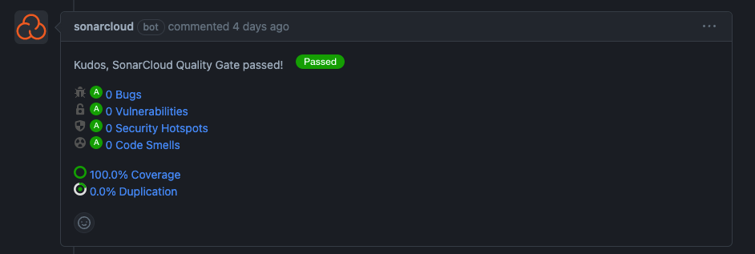
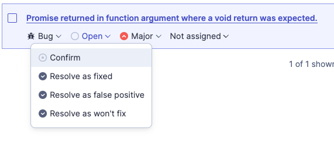

# Sonar

Atualmente temos o sonar da project configurado para todos os projetos React Native do Super App. Suas configurações estão definidas no arquivo `sonar-project.properties` de cada repositório e a execução é feita pelas pipelines do GitHub, que ficam localizadas no arquivo `.github/workflows/pipelines.yml`.

## Acesso

Para ter acesso ao sonar, é preciso logar com a conta do **GitHub** no [sonarcloud](https://sonarcloud.io/organizations/microfrontend/projects). Após isso, é preciso solicitar para o Eloi Mendes ou o time de arquitetura o acesso ao projeto da "microfrontend", passando o nome do usuário GitHub presente no canto superior direito > My Account.


## Execução

A execução do sonar é definida no arquivo `pipelines.yml` de cada repositório. O `sonarcloud-github-action` é a action executada para fazer a análise do código com base nas regras descritas no arquivo `sonar-project.properties`. Ela é executada tanto ao fazer o merge para uma branch especificada em _on > branches > [dev,hmg,stage,master]_, quanto para qualquer pull request aberto com a branch de destino especificada em _on > pull-request > [dev,hmg,stage,master]_.

## Extensão VSCode

Para não precisarmos aguardar a execução da pipeline para saber se há problemas no código escrito, podemos instalar a extensão SonarLint ao VSCode. Esta extensão irá acusar os erros em tempo real no editor.

```text
Nome: SonarLint
ID: SonarSource.sonarlint-vscode
Editor: SonarSource
Link do Marketplace do VS: https://marketplace.visualstudio.com/items?itemName=SonarSource.sonarlint-vscode
```

Após a instalação, acesse a extensão na barra lateral esquerda onde as extensões ficam localizadas. Clique em **Add SonarCloud Connection**. Aqui, será solicitado um token que deve ser gerado em [My Account > Security](https://sonarcloud.io/account/security/). Digite um nome para seu token e, após gerado, salve em algum lugar para não perdê-lo e o preencha no campo "User Token".



Clique em Save Connection.

Caso apareça algum popup indicando a sincronização com os projetos da _microfrontend_, verifique se o projeto está indicado corretamente e, caso esteja, clique em **Configure Binding**. Caso não esteja correto (projeto do login referenciando de produtos, por exemplo), clique em **Choose Manually** e selecione o projeto correto.



Caso não consiga atualizar pelo popup, é possível fazer o bind do projeto no ícone `+` indicado abaixo. Somente projetos React Native possuem o sonar. Caso deseje conferir quais projetos possuem sonar, basta acessar [sua página](https://sonarcloud.io/organizations/microfrontend) e procurar pelo nome do projeto.



Agora, é preciso identificar o caminho ao executável do node para poder fazer a análise de código javascript e typescript. Adicione ao seu arquivo de configuração de usuário do VSCode o trecho abaixo, trocando XX.XX.X pela versão do node mais recente instalada na sua máquina.

```json
{
    "sonarlint.pathToNodeExecutable": "/Users/your.name/.nvm/versions/node/vXX.XX.X/bin/node"
}
```

:::caution Atenção
A versão mínima suportada é a 14.17.0
:::

Agora, sua extensão SonarLint deve estar configurada corretamente. Com essas configurações, é possível ver em tempo real os problemas indicados e também consultar a documentação de cada issue.




## Resolução de problemas

Caso o sonar encontre code smells ou bugs no código, ele irá deixar um comentário no Pull Request.



Às vezes, ele pode indicar problemas que são falso positivos ou precisam ser ignorados naquele trecho em específico por se tratar de uma exceção. Nesse caso, é possível acessar a análise do PR no SonarCloud e marcar a issue como _false positive_ ou _won't fix_. Basta solicitar a alteração ao time de arquitetura, enviando também uma justificativa para tal.


